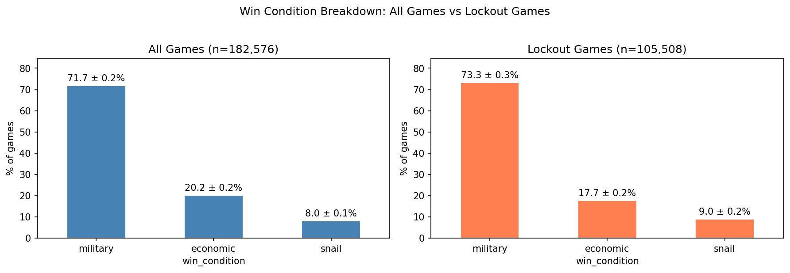
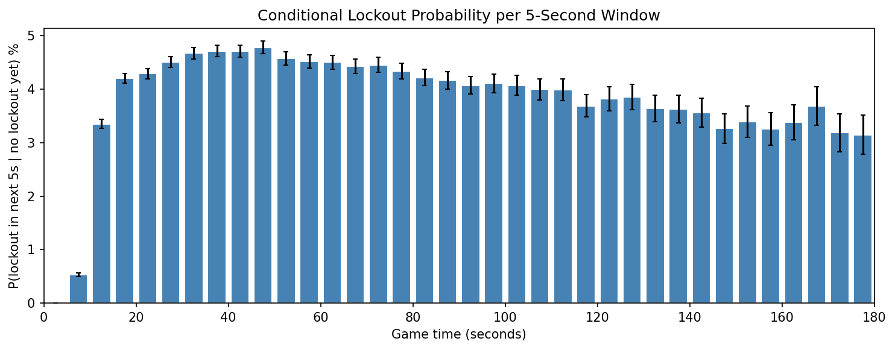
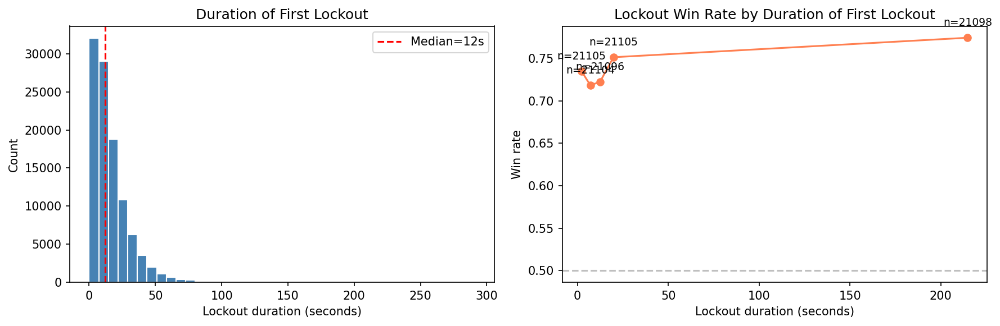
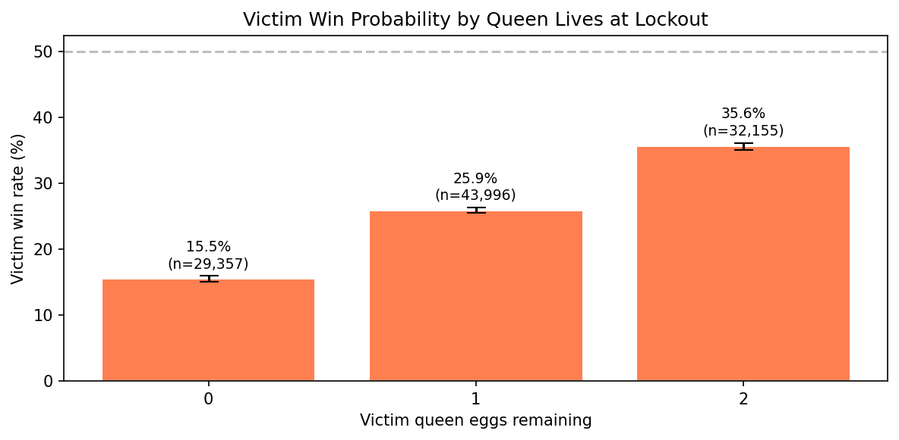

# Lockout Analysis

**Lockout** in Killer Queen: one team controls all 3 warrior gates (wings maidens), has 2+ warriors, and the opponent has zero warriors — leaving them unable to upgrade.

Dataset: 182,576 logged-in games from Hivemind (`logged_in_games/`). Full analysis code: [lockout_analysis.ipynb](lockout_analysis.ipynb).

**Contents:**
[Game Quality Metric](#game-quality-metric) · [How Common is Lockout?](#how-common-is-lockout) · [Data Quality Effects](#data-quality-effects) · [Map Differences](#map-differences) · [Skill Effects](#skill-effects) · [Timing of First Lockout](#timing-of-first-lockout) · [Conditional Lockout Rate](#conditional-lockout-rate) · [Lockout Duration](#lockout-duration) · [Victim Queen Lives](#victim-queen-lives) · [Tournament vs. Casual](#tournament-vs-casual) · [Summary](#summary)

## Game Quality Metric

Not all games in the dataset are competitive. Cabinets in bars see plenty of casual play — kids mashing buttons, people wandering off mid-game, lopsided 5v1 matchups. To distinguish competitive games from noise, we trained a **game quality classifier**: a LightGBM model that takes 69 hand-crafted features over the full event stream of a game (berry counts, kill patterns, snail progress, maiden usage, game duration, etc.) and predicts whether the game looks like one played by logged-in Hivemind users (the positive class) versus an unfiltered anonymous game (the negative class). The intuition is that games with logged-in players are more likely to be deliberate, competitive play.

The classifier outputs a score from 0 to 1. The threshold of **0.3643** was chosen to achieve 99% recall on late-round tournament games — i.e., virtually all tournament play scores above this line. Games below the threshold tend to be very short, one-sided, or show patterns inconsistent with two teams actually trying to win.

This analysis uses the quality score to stratify results and check whether lockout patterns differ between low-quality and high-quality games.

## How Common is Lockout?

Lockout occurs in **57.8%** [57.6%, 58.0%] of logged-in games. More than half of all games reach a state where one team completely controls warrior access.

The lockout team wins **74.0%** [73.8%, 74.3%] of the time — a strong but far from guaranteed advantage.

**Win condition breakdown (lockout games):**

| Win condition | Count | % of lockout games |
|---|---|---|
| Military | 77,294 | 73.3% |
| Economic | 18,700 | 17.7% |
| Snail | 9,514 | 9.0% |

Military wins dominate lockout games, which makes sense — the locking-out team has warrior superiority and can press it for queen kills.

Compared to all games, lockout games see a large shift toward military wins and a corresponding decrease in economic and snail wins.

**Warrior count at lockout:**

| Warriors | Count | % |
|---|---|---|
| 2 | 67,308 | 63.8% |
| 3 | 36,271 | 34.4% |
| 4 | 1,929 | 1.8% |

Most lockouts happen with the minimum 2 warriors, meaning teams achieve lockout quickly rather than building up a full warrior complement first.

## Data Quality Effects

85.5% of logged-in games score above the quality threshold (0.3643). The logged-in filter already selects for higher-quality games, but a long tail of lower-quality games remains.

**Quality tier distribution:**

| Tier | Games |
|---|---|
| Below threshold (<0.36) | 26,424 |
| Medium (0.36–0.6) | 22,699 |
| High (0.6–0.8) | 75,504 |
| Very high (0.8+) | 57,949 |

Lockout frequency rises sharply with game quality: 27% in below-threshold games vs. 63–66% in high/very-high quality games. This likely reflects that competitive games involve more deliberate maiden control. Win rate when locked out is fairly stable across tiers (72–75%), suggesting lockout is similarly decisive regardless of game quality.

## Map Differences

| Map | Lockout freq | Win rate |
|---|---|---|
| Night | 64.9% | 74.5% |
| Day | 57.3% | 76.1% |
| Dusk | 56.4% | 73.9% |
| Twilight | 49.8% | 68.5% |

Night has the highest lockout frequency (64.9%), while Twilight has the lowest (49.8%). Day has the highest lockout win rate (76.1%) despite middling frequency. Twilight stands out with both the lowest frequency and lowest win rate (68.5%) — lockout is hardest to achieve and least decisive on this map.

## Skill Effects

### Does lockout override a skill deficit?

Even when the lockout team is the lower-skilled team, they still win **68.5%** of the time (46,539 games). Lockout partially overrides a skill deficit but doesn't erase it — higher-skilled teams that lock out win at ~80%, while lower-skilled teams that lock out win at ~68%.

### Queen skill

The victim queen's skill has a clear effect: better victim queens are harder to finish off even when locked out (win rate drops from ~77% to ~72% as victim queen skill increases). The lockout team's queen skill shows a weaker but positive trend — better queens convert lockout to wins more reliably.

### Punitiveness by skill level

In even-matched games (skill differential < 4.1), lockout win rate is fairly flat across skill levels: 72.2% at the lowest skill bin to 75.2% at the highest. Lockout is roughly equally punishing at all skill levels.

## Timing of First Lockout

This measures when the first lockout occurs in each game (not how long it lasts — see Duration below). Median time of first lockout is **48 seconds** — lockout happens early. The distribution is right-skewed with most first lockouts occurring within the first 60 seconds.

Early vs. late first-lockout win rates are nearly identical: 74.2% (early) vs. 73.8% (late). When lockout first occurs doesn't meaningfully affect how decisive it is. Only 310 of 105,508 lockout games (0.3%) see their first lockout after 300 seconds.

## Conditional Lockout Rate

The timing histogram above shows *when* lockout happens, but a more useful question is: given that a game has reached time T without lockout, what's the probability lockout occurs in the next 5 seconds? This is the discrete hazard rate.

The hazard peaks at **4.8%** around **t=48s** — if a game reaches 48 seconds without lockout, there's roughly a 1-in-20 chance it happens in the next 5 seconds. After the peak the rate gradually declines: by 120s it's down to 3.8%. This shape makes sense — games that were going to get locked out mostly already have been, so the surviving population is increasingly lockout-resistant.

## Lockout Duration

After the first lockout is achieved, how long does it last? Duration is measured from the moment lockout conditions are first met until the victim team **gets a warrior** — meaning a drone touches a wings maiden and receives wings. Intermediate changes don't end the lockout: the victim queen can tag a gate, or kill an opposing warrior, but as long as the victim team has zero warriors they remain locked out and the clock keeps running. If the victim never forms a warrior, the duration extends to the game-ending event.

Longer-lasting lockouts tend to be more decisive, as the locking-out team has more time to press their advantage for military kills or economic/snail wins.

## Victim Queen Lives

How much does the victim queen's status at the moment of lockout matter? Queen "eggs" represent remaining lives: 2 means the queen hasn't died yet, 1 means she's died once, 0 means she's died twice (one life left).

| Eggs remaining | Victim win rate | 95% CI | Games |
|---|---|---|---|
| 2 (no deaths) | 35.6% | ±0.5% | 32,155 |
| 1 (died once) | 25.9% | ±0.4% | 43,996 |
| 0 (died twice) | 15.5% | ±0.4% | 29,357 |

Each queen death roughly halves the victim's comeback odds. A victim queen with full lives still loses the majority of the time, but has more than double the win rate of a queen on her last life. This makes sense — a queen with lives to spare can play aggressively to retake gates, while a queen on last life must play conservatively or risk a military loss.

## Tournament vs. Casual

| Setting | Games | Lockout freq | 95% CI | Win rate | 95% CI |
|---|---|---|---|---|---|
| Tournament | 29,571 | 66.1% | [65.5%, 66.6%] | 78.1% | [77.5%, 78.7%] |
| Casual | 153,005 | 56.2% | [55.9%, 56.4%] | 73.1% | [72.8%, 73.4%] |

Tournament games have significantly higher lockout frequency (66.1% vs. 56.2%) and higher lockout win rate (78.1% vs. 73.1%). Tournament players are better at achieving lockout and better at converting it to wins. Both differences are well outside the 95% confidence intervals.

## Summary

- **Lockout is extremely common** — 57.8% of logged-in games, rising to 66% in tournament play.
- **Lockout is decisive but not deterministic** — 74% win rate overall, 78% in tournaments.
- **Military wins dominate** lockout games (73%), as expected from warrior superiority.
- **Map matters** — Twilight has the lowest lockout rate (50%) and win rate (69%); Night has the highest rate (65%).
- **Lockout partially overrides skill deficits** — even lower-skilled teams win 69% when they lock out.
- **Lockout happens early** — median first lockout at 48 seconds — and timing doesn't affect win rate.
- **Conditional lockout rate peaks around 48s then declines** — the hazard rate falls as lockout-prone games exit the at-risk pool.
- **Longer lockouts are more decisive** — lockout duration correlates with win rate.
- **Victim queen lives matter a lot** — victim win rate drops from 36% (no deaths) to 16% (two deaths) at lockout.
- **Higher-quality games have more lockout** (27% below-threshold vs. 66% very-high), but win rate is stable across quality tiers.
- **Tournament players lock out more often and convert more reliably** than casual players.
