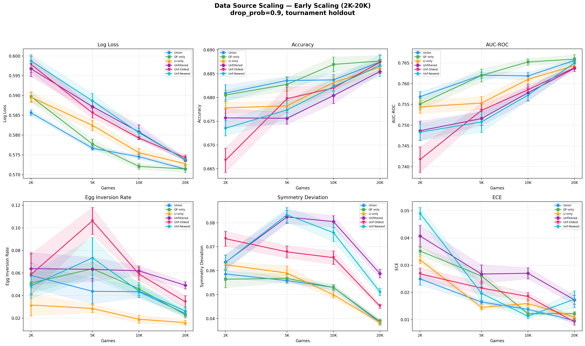
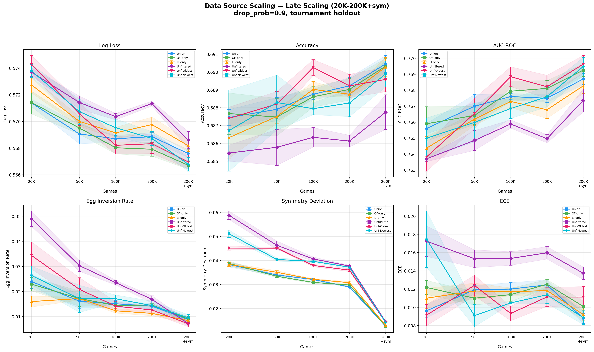

# Combined Data Source Scaling Report

## Overview

This experiment compares six training data sources for the win-probability model across
seven scale points (2K-200K games), plus a final 200K+symmetry-augmentation run. All
experiments use `drop_prob=0.9` (subsample ~10% of states per game) and evaluate on
the same tournament holdout set (693 games, 322K sym-augmented states).

## Data Sources

| Source | Description | Pool Size |
|--------|-------------|-----------|
| **QF-only** | Quality-filtered games (score >= 0.3643), sorted by quality score desc | 182K |
| **LI-only** | Logged-in games (>=1 logged-in player), sorted by login count desc | 183K |
| **Union** | Deduplicated QF+LI interleaved by rank | 257K |
| **Unfiltered** | All games, shuffled (fixed seed) | 917K |
| **Unf-Oldest** | All games, chronological order (oldest first) | 917K |
| **Unf-Newest** | All games, reverse chronological (newest first) | 917K |

QF and LI overlap by ~108K games. The Union pool interleaves them round-robin by quality
rank, deduplicating on the fly. Top-N sampling ensures the best available data at each
scale point.

## Scaling Schedule

| Games | Leaves | Trees | Seeds |
|-------|--------|-------|-------|
| 2,000 | 15 | 25 | 5 |
| 5,000 | 35 | 35 | 5 |
| 10,000 | 50 | 50 | 5 |
| 20,000 | 50 | 50 | 5 |
| 50,000 | 75 | 75 | 5 |
| 100,000 | 100 | 100 | 5 |
| 200,000 | 150 | 150 | 5 |
| 200,000+sym | 100 | 100 | 10 |

The final row uses symmetry augmentation (2x training states) with 100L/100T
(optimal capacity from sweep) and 10 seeds for tighter variance estimates.

## Results

### Base Scaling at 200K (no sym-aug, 5 seeds)

| Source | Log Loss | Accuracy | AUC |
|--------|----------|----------|-----|
| QF-only | 0.5679 +/- 0.0005 | 0.6890 +/- 0.0006 | 0.7681 +/- 0.0005 |
| Unf-Oldest | 0.5683 +/- 0.0007 | 0.6892 +/- 0.0007 | 0.7682 +/- 0.0007 |
| Unf-Newest | 0.5687 +/- 0.0005 | 0.6883 +/- 0.0008 | 0.7676 +/- 0.0006 |
| Union | 0.5689 +/- 0.0003 | 0.6892 +/- 0.0005 | 0.7675 +/- 0.0003 |
| LI-only | 0.5698 +/- 0.0006 | 0.6888 +/- 0.0002 | 0.7668 +/- 0.0005 |
| Unfiltered | 0.5713 +/- 0.0002 | 0.6861 +/- 0.0003 | 0.7650 +/- 0.0003 |

### 200K + Symmetry Augmentation (10 seeds)

| Source | Log Loss | Accuracy | AUC | Egg Inv | Sym Dev | ECE |
|--------|----------|----------|-----|---------|---------|-----|
| **QF-only** | **0.5667 +/- 0.0003** | 0.6903 +/- 0.0004 | 0.7693 +/- 0.0004 | 0.0091 | 0.0127 | 0.0101 |
| Unf-Newest | 0.5668 +/- 0.0005 | 0.6899 +/- 0.0007 | 0.7695 +/- 0.0006 | 0.0095 | 0.0142 | 0.0089 |
| Unf-Oldest | 0.5670 +/- 0.0005 | 0.6896 +/- 0.0007 | 0.7696 +/- 0.0005 | 0.0071 | 0.0143 | 0.0111 |
| Union | 0.5676 +/- 0.0003 | **0.6905 +/- 0.0005** | 0.7687 +/- 0.0004 | 0.0088 | **0.0126** | 0.0088 |
| LI-only | 0.5682 +/- 0.0004 | 0.6903 +/- 0.0005 | 0.7683 +/- 0.0005 | 0.0084 | 0.0130 | 0.0092 |
| Unfiltered | 0.5686 +/- 0.0006 | 0.6878 +/- 0.0010 | 0.7674 +/- 0.0007 | 0.0073 | 0.0145 | 0.0137 |

### Capacity Sweep (200K union, no state dropping, sym-aug)

| Config | Log Loss | Accuracy | Egg Inv | Sym Dev | ECE |
|--------|----------|----------|---------|---------|-----|
| **100L/100T** | **0.5678** | 0.6901 | **0.0070** | **0.0119** | **0.0087** |
| 150L/150T | 0.5679 | 0.6904 | 0.0108 | 0.0124 | 0.0100 |
| 200L/200T | 0.5683 | 0.6901 | 0.0112 | 0.0131 | 0.0108 |

100L/100T is optimal — larger models overfit, worsening log loss, egg inversion,
symmetry deviation, and calibration.

## Scaling Plots

## Key Findings

1. **QF-only is the best data source on log loss** (0.5667), followed closely by
   Unf-Newest (0.5668) and Unf-Oldest (0.5670). The top three are within each
   other's error bars.

2. **Symmetry augmentation helps all sources.** The improvement from 200K to
   200K+sym is ~0.0012-0.0027 in log loss depending on source, with the unfiltered
   variants benefiting most. Without sym-aug, Unfiltered-shuffled was clearly worst
   (0.5713); with it, Unf-Newest jumps to second place (0.5668).

3. **Sym-aug halves symmetry deviation** across the board — from ~0.029-0.038 down
   to ~0.013-0.015. This is expected: training on both team orientations forces the
   model to treat them symmetrically.

4. **Union has the best symmetry deviation** (0.0126) among sym-aug runs and the
   best ECE (0.0088), even though it doesn't win on log loss. This may be because
   the balanced QF+LI mix provides more diverse game situations.

5. **Unfiltered data ordering matters without sym-aug** — oldest-first (0.5683) beats
   shuffled (0.5713) and newest-first (0.5687) at 200K. But with sym-aug, this
   reverses: newest-first (0.5668) slightly beats oldest-first (0.5670). The ordering
   effect largely disappears when the model sees both team perspectives.

6. **100L/100T is the capacity sweet spot.** Larger models (150L, 200L) show worse
   log loss, egg inversion, symmetry deviation, and calibration — clear overfitting.

7. **Data quality filtering matters at small scale but converges at large scale.**
   At 2K games, QF-only beats Unfiltered by 0.007 in log loss. At 200K+sym, the gap
   shrinks to 0.002. More data compensates for lower average quality.

## Best Model

QF-only, 200K games, drop_prob=0.9, symmetry augmented, 100L/100T:
- **Log loss: 0.5667** (10-seed mean)
- Accuracy: 0.6903
- AUC: 0.7693
- Egg inversion: 0.0091
- Symmetry deviation: 0.0127
- ECE: 0.0101

Saved model: `qf_200k_symaug_100l_100t.mdl` (seed=42)
