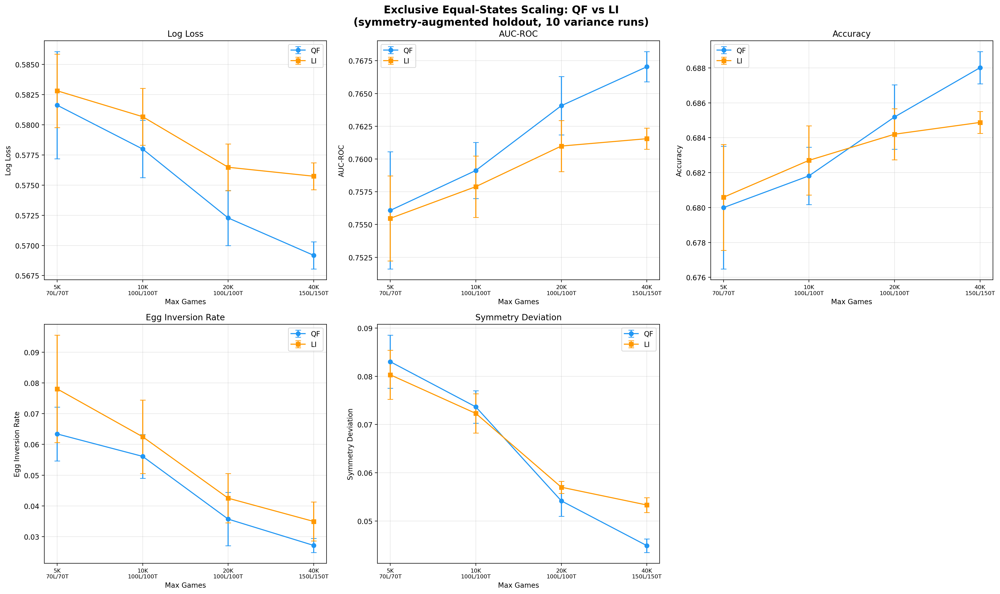
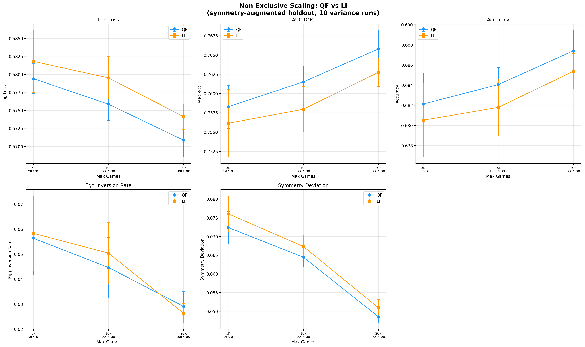
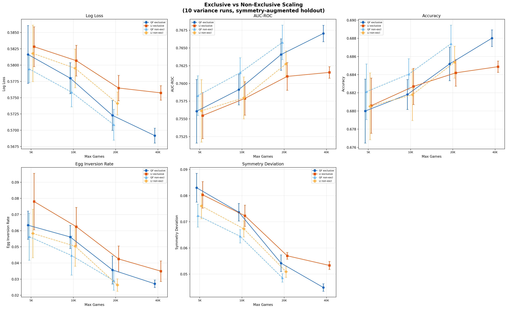
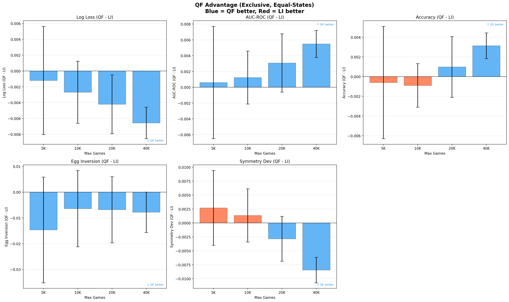
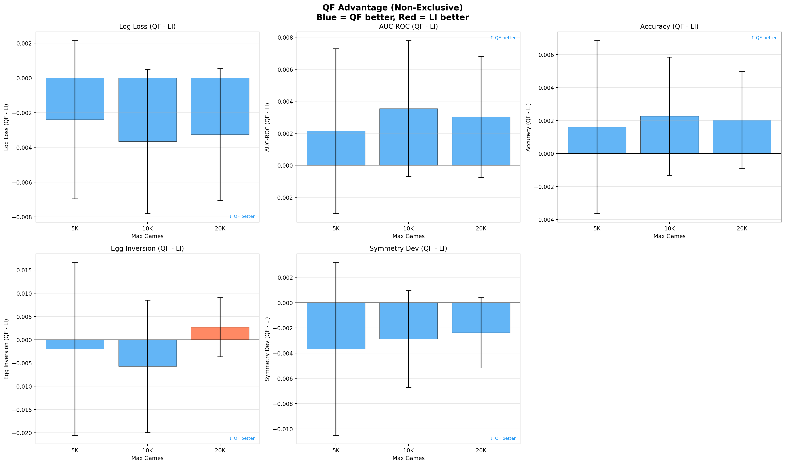

# Data Quality Filtering Report

Does training on quality-filtered games produce a better win-probability model
than training on the larger but noisier logged-in-games dataset?

## Quality Classifier

Games are filtered by a LightGBM binary classifier trained to distinguish
competitive games from junk/practice/button-check games using 69 hand-crafted
event-stream features. The classifier achieves AUC ~0.908, with a threshold
calibrated so 99% of tournament games pass.

Full details: [quality_classifier_report.md](../game_quality_classifier/quality_classifier_report.md)

## Datasets

| Dataset | Description | Size |
|---------|-------------|------|
| **quality_filtered (QF)** | Unfiltered games passing the quality classifier threshold (score >= 0.3643). Sorted by quality score descending. | ~182K games |
| **logged_in_games (LI)** | Games with at least one logged-in player, sorted by login count. | ~183K games |
| **late_tournament_games** | Tournament games held out for evaluation. | ~693 games (~1.4K after symmetry augmentation) |

QF and LI are similar in size but differ in composition. They share ~108K
games; each has ~75K exclusive games the other lacks. The exclusive subsets
isolate the signal from quality filtering vs. login-based selection.

Each game produces many states (one per event, typically ~100-300), so state
counts are much larger than game counts.

## Experiment Design

### Win-Probability Model

LightGBM binary classifier predicting P(gold wins) from in-game state features
(69 features: berry counts, snail position, kills, carries, etc.). Each game
produces ~100-300 training states (one per event).

### Evaluation Metrics

- **Log loss**: Primary metric. Lower is better.
- **AUC-ROC**: Discrimination ability. Higher is better.
- **Accuracy**: Classification accuracy at 0.5 threshold. Higher is better.
- **Egg inversion rate**: Fraction of evaluation positions where the model
  assigns >50% win probability to the losing team. Lower is better. Computed
  on 5,000 samples.
- **Symmetry deviation**: Mean |P(gold wins | features) - (1 - P(gold wins | swapped features))|.
  Measures consistency under team swap. Lower is better.

### Holdout Set

693 late tournament games, doubled to ~1.4K via symmetry augmentation
(blue/gold team swap), producing ~250K evaluation states. Excluded from all
training sets.

### Experiment Modes

**Exclusive (equal-states)**: Trains only on games unique to each dataset
(QF-exclusive vs LI-exclusive). To control for data volume, the larger set is
subsampled at the game level to match the smaller set's state count. This
isolates the effect of game quality from data quantity.

**Non-exclusive**: Trains on the full datasets (overlapping games may appear in
both). Since QF and LI are similar in total size (~182-183K games), this
primarily tests whether the non-overlapping games in each set help or hurt.

### Capacity Schedule

Model capacity scales with data size to avoid underfitting or overfitting:

| Max Games | Leaves | Trees |
|-----------|--------|-------|
| 5,000 | 70 | 70 |
| 10,000 | 100 | 100 |
| 20,000 | 100 | 100 |
| 40,000 | 150 | 150 |

Schedule derived from prior scaling experiments showing 100L/100T as the
sweet spot for 5-20K games, with larger models overfitting at small data sizes.

### Variance Runs

Each scale point is repeated 10 times with different random seeds (controlling
game subsampling). Error bars show +/- 1 standard deviation.

## Results

### Exclusive Scaling (Equal-States)



QF-exclusive consistently outperforms LI-exclusive across all metrics and
scale points when controlling for training data volume.

### Non-Exclusive Scaling



With overlapping datasets and QF's larger pool, QF wins more convincingly.
Non-exclusive 40K was not completed due to memory constraints.

### Side-by-Side Comparison



### QF Advantage (Deltas)





Blue bars indicate QF outperforms LI; red bars indicate the reverse.

## Conclusions

Quality-filtered games produce better win-probability models than
logged-in games at every scale tested, even when controlling for data
volume (equal-states exclusive comparison). The advantage is consistent
across log loss, AUC-ROC, accuracy, and symmetry deviation. Egg inversion
rates show more variance but trend in QF's favor at larger scales.

The quality classifier successfully identifies games that are more useful
for training, beyond what login-based filtering achieves alone.

## Reproduction

```bash
# Run exclusive scaling experiments
python model_experiments/data_quality_experiment.py \
    --exclusive --equal-states --variance 10 \
    --max-games 5000 --num-leaves 70 --num-trees 70 \
    --output model_experiments/scaling_exclusive_5000.json

# Run non-exclusive scaling experiments
python model_experiments/data_quality_experiment.py \
    --variance 10 --max-games 5000 --num-leaves 70 --num-trees 70 \
    --output model_experiments/scaling_nonexclusive_5000.json

# Generate plots
jupyter nbconvert --execute model_experiments/scaling_plots.ipynb
```
