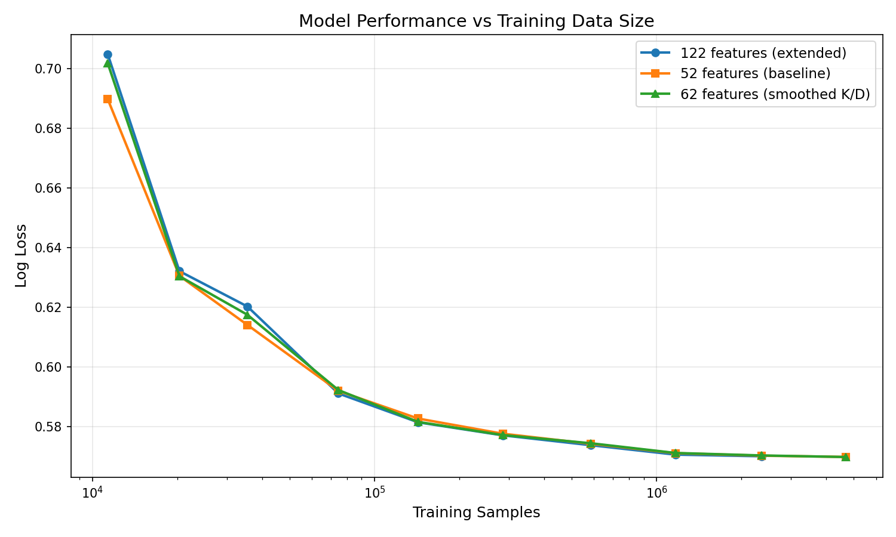

# Scaling & Feature Ablation Report

## Overview

This report documents experiments measuring how model performance scales with training data size, and the impact of additional per-player running statistics features.



## Feature Sets

### Baseline (52 features)
- Team aggregate: eggs, food_deposited, wings_no_speed, wings_and_speed (4 per team = 8)
- Worker base: is_bot, has_food, has_speed, has_wings (4 per worker × 4 workers × 2 teams = 32)
- Maidens: 6 maiden states
- Map: one-hot encoding (4 maps)
- Snail: position, speed (2)
- Berries: available (1)

**Total: 52 features**

### Extended (122 features)
All baseline features plus per-player running statistics:

- Queen stats (per team): kills, deaths, queen_kills, military_kills, drone_kills (5 × 2 = 10)
- Worker stats (per worker): kills, deaths, queen_kills, military_kills, drone_kills, military_deaths, drone_deaths, berries, snail_progress (9 × 4 × 2 = 72)

**Total: 52 + 10 + 72 = 122 features** (note: some pruned based on ablation study)

---

## Experiment 1: Extended Features (122 features)

**Date:** 2026-01-18
**Branch:** experiment/player-stats-ablation
**Data type:** float32

### Configuration
- Test shards: Start at 1, double until 20, then freeze
- Train shards: Start at 1, double until OOM
- Drop probability: 90%
- Model: LightGBM, 100 leaves, 100 rounds

### Results

| Train Shards | Test Shards | Train Samples | Log Loss | Accuracy |
|--------------|-------------|---------------|----------|----------|
| 1 | 1 | 11,343 | 0.7047 | 64.4% |
| 2 | 2 | 20,352 | 0.6320 | 65.6% |
| 4 | 4 | 35,437 | 0.6202 | 65.9% |
| 8 | 8 | 74,473 | 0.5911 | 67.7% |
| 16 | 16 | 142,739 | 0.5814 | 68.3% |
| 32 | 20 | 284,945 | 0.5770 | 68.6% |
| 64 | 20 | 585,752 | 0.5737 | 68.8% |
| 128 | 20 | 1,166,276 | 0.5706 | 69.1% |
| 256 | 20 | 2,357,991 | 0.5700 | 69.1% |

**Stopped:** OOM during 512-shard iteration (4.6M samples loaded, killed during vstack/training)

### Observations
1. Rapid improvement from 1→32 shards (0.70 → 0.58 log loss, 16% reduction)
2. Diminishing returns after ~128 shards
3. Memory limit reached at ~4.6M samples with 122 features

---

## Experiment 2: Baseline Features (52 features)

**Date:** 2026-01-18
**Branch:** experiment/player-stats-ablation (baseline mode)
**Data type:** float32

### Configuration
- Same as Experiment 1 (test shards double until 20, then freeze)

### Results

| Train Shards | Test Shards | Train Samples | Log Loss | Accuracy |
|--------------|-------------|---------------|----------|----------|
| 1 | 1 | 11,343 | 0.6896 | 64.8% |
| 2 | 2 | 20,352 | 0.6305 | 65.7% |
| 4 | 4 | 35,437 | 0.6140 | 66.1% |
| 8 | 8 | 74,473 | 0.5919 | 67.5% |
| 16 | 16 | 142,739 | 0.5827 | 68.1% |
| 32 | 20 | 284,945 | 0.5776 | 68.5% |
| 64 | 20 | 585,752 | 0.5742 | 68.8% |
| 128 | 20 | 1,166,276 | 0.5710 | 69.0% |
| 256 | 20 | 2,357,991 | 0.5702 | 69.1% |
| **512** | 20 | 4,681,053 | **0.5698** | 69.1% |

**Completed successfully** - smaller feature set used less memory

---

## Comparison: 122 vs 52 Features

| Train Shards | 122 Features | 52 Features | Δ Log Loss |
|--------------|--------------|-------------|------------|
| 1 | 0.7047 | 0.6896 | **+0.0151** (baseline better) |
| 2 | 0.6320 | 0.6305 | **+0.0015** (baseline better) |
| 4 | 0.6202 | 0.6140 | **+0.0062** (baseline better) |
| 8 | 0.5911 | 0.5919 | -0.0008 (extended better) |
| 16 | 0.5814 | 0.5827 | -0.0013 (extended better) |
| 32 | 0.5770 | 0.5776 | -0.0006 (extended better) |
| 64 | 0.5737 | 0.5742 | -0.0005 (extended better) |
| 128 | 0.5706 | 0.5710 | -0.0004 (extended better) |
| 256 | 0.5700 | 0.5702 | -0.0002 (extended better) |
| 512 | OOM | 0.5698 | N/A |

### Key Findings

1. **Small data regime (1-4 shards):** Baseline 52 features outperform extended 122 features
   - Likely due to overfitting with more features on limited data

2. **Medium-large data (8+ shards):** Extended features show small but consistent improvement
   - ~0.0004-0.0013 log loss improvement

3. **Diminishing returns:** Both feature sets plateau around 128-256 shards
   - 512 shards only improved 0.0004 over 256 shards

4. **Feature benefit crossover:** Extended features become beneficial around 8 shards (~75K samples)

5. **Memory efficiency:** 52 features completed 512 shards; 122 features OOM'd at same point
   - Memory reduction: 52/122 = 43% of feature memory usage

---

## Experiment 3: Smoothed Military K/D Feature (62 features)

**Date:** 2026-01-18
**Branch:** experiment/player-stats-ablation
**Data type:** float32

### Feature Description

Added a single derived feature per player on top of the 52-feature baseline:

```python
# preprocess.py:733-734 (workers)
smoothed_mil_kd = (worker.military_kills + 1) / (worker.military_deaths + 2)

# preprocess.py:739-740 (queens)
smoothed_mil_kd = (queen.military_kills + 1) / (queen.deaths + 2)
```

This Laplace-smoothed ratio avoids division by zero and provides a bounded estimate of military kill/death performance. Applied to:
- Queens: using `military_kills` and `deaths` (queens don't track `military_deaths` separately)
- Workers: using `military_kills` and `military_deaths`

**Total: 52 + 10 players = 62 features**

### Results

| Train Shards | Test Shards | Train Samples | Log Loss | Accuracy |
|--------------|-------------|---------------|----------|----------|
| 1 | 1 | 11,343 | 0.7016 | 64.3% |
| 2 | 2 | 20,352 | 0.6304 | 66.0% |
| 4 | 4 | 35,437 | 0.6174 | 66.3% |
| 8 | 8 | 74,473 | 0.5922 | 67.4% |
| 16 | 16 | 142,739 | 0.5815 | 68.4% |
| 32 | 20 | 284,945 | 0.5771 | 68.6% |
| 64 | 20 | 585,752 | 0.5744 | 68.7% |
| 128 | 20 | 1,166,276 | 0.5711 | 69.1% |
| 256 | 20 | 2,357,991 | 0.5703 | 69.1% |
| **512** | 20 | 4,681,053 | **0.5698** | 69.2% |

**Completed successfully**

---

## Comparison: 62 vs 52 Features (Smoothed K/D vs Baseline)

| Train Shards | 62 Features | 52 Features | Δ Log Loss |
|--------------|-------------|-------------|------------|
| 1 | 0.7016 | 0.6896 | **+0.0120** (baseline better) |
| 2 | 0.6304 | 0.6305 | -0.0001 (tie) |
| 4 | 0.6174 | 0.6140 | **+0.0034** (baseline better) |
| 8 | 0.5922 | 0.5919 | +0.0003 (baseline better) |
| 16 | 0.5815 | 0.5827 | -0.0012 (62-feat better) |
| 32 | 0.5771 | 0.5776 | -0.0005 (62-feat better) |
| 64 | 0.5744 | 0.5742 | +0.0002 (baseline better) |
| 128 | 0.5711 | 0.5710 | +0.0001 (tie) |
| 256 | 0.5703 | 0.5702 | +0.0001 (tie) |
| 512 | 0.5698 | 0.5698 | 0.0000 (tie) |

### Observations

1. **No consistent benefit:** The smoothed military K/D feature shows no clear advantage over baseline
2. **Small data penalty:** Similar to the 122-feature experiment, more features hurt in the small data regime
3. **Convergence:** Both feature sets converge to the same 0.5698 log loss at 512 shards
4. **The feature may be redundant:** The model can likely infer similar information from raw kills/deaths

---

## Prior Ablation Study Results

From commit 4c45bb5, ablation study on shards 900-911:

**Features that hurt performance (removed):**
- queen_queen_kills
- queen_drone_kills
- worker_queen_kills

**Features that help performance (kept):**
- worker_military_kills (+0.0044 log loss delta)
- worker_drone_deaths (+0.0031)
- worker_military_deaths (+0.0024)
- worker_drone_kills (+0.0021)
- worker_snail_progress (+0.0020)

**Overall:** 122 features achieved 0.5908 log loss vs 0.5919 baseline (0.0011 improvement)
